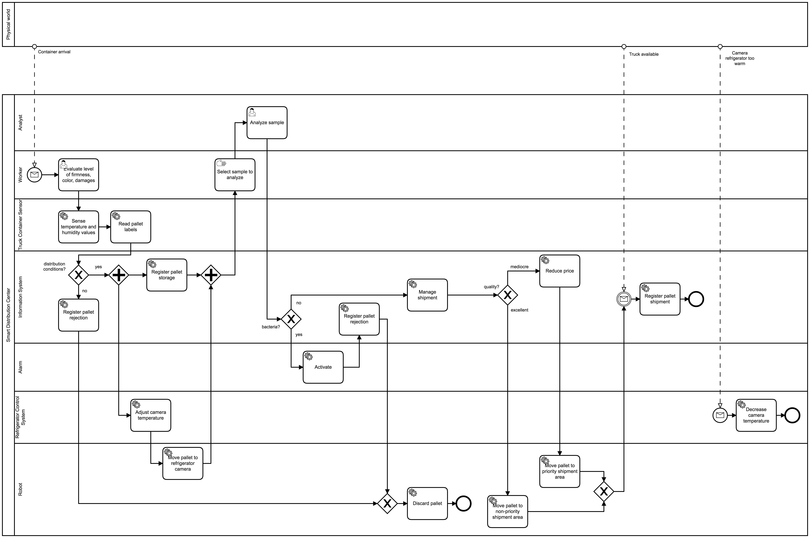

# IoT Enhanced Business Processes. Protegee plugin to facilitate the definition of high-level events

his repository contains a Protegee plugin to facilitate the creation of high-level events from context data. High level events are defined in SPARQL rules and injected into a BP Controller microservice created by using the  infrastructure available in the following Github repository: [iot-enhanced-business-process-example](https://github.com/pvalderas/iot-enhanced-business-process-example). In the same way, context data must be registered in a Eureka server by business microservices. This business microservices are in charge of managing IoT devices. They can be developed through the support provided by the infrastructure presented above.

This plugin is an extension of the SPARQL Tab plugin available in the follwing [Github repository] (https://github.com/protegeproject/sparql-query-plugin)

# About

This is a contribution of a research work leaded by Pedro Valderas at the PROS Research Center, Universitat Politècnica de València, Spain.

This work presents a modelling approach based on BPMN and context ontologies to model IoT-enhanced BPs. This modelling approach is suppoted by a microservice architecture aimed at facilitating the integration of business processes with the physical world that provides high flexibility to support multiples IoT device technologies, and facilitates evolution and maintenance.

# Example overview

The BPMN IoT-Enhanced business process supported by these microservices is the following:

The process starts when a container with a pallet of a same product arrives to the smart distribution centre.
The first thing to do at the distribution centre is to check the quality of the products of the pallet (level of firmness, colour, and possible damages). This is done by a worker who is in charge of registering the results in the system. Next, the conditions in which the products have been transported, i.e., the container’s temperature and humidity are automatically sensed. Based on this first evaluation, the products are considered in good quality or not for distribution. If not, the rejection of the pallet is registered and it is discarded by moving it to a garbage. On the contrary, if the quality of the products is good for consumption, the pallet is registered in the distribution centre and placed into a transportation line to be stored in a refrigerated camera climatized accordingly to avoid product spoilage (e.g., oranges must be kept between 2 and 12 Celsius degrees and at 90% relative humidity). 
Besides this first product control, a second one is performed over a sample in the laboratory. This analysis will determine whether molds, yeast, and certain bacteria has grown in the received products. If so, an alarm is activated, and the pallet is discarded by transporting it to the garbage. If no bacteria are detected, the shipment task of the received products can start. If the quality of the products is not excellent (e.g., they are good for distribution but firmness or colour are not the optimum), the price of the products is reduced and the pallet is prioritized to avoid their spoilage. Finally, all shipped pallets are registered in the system once a truck for transporting them is available.

As we can see, there are two main 